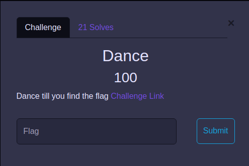
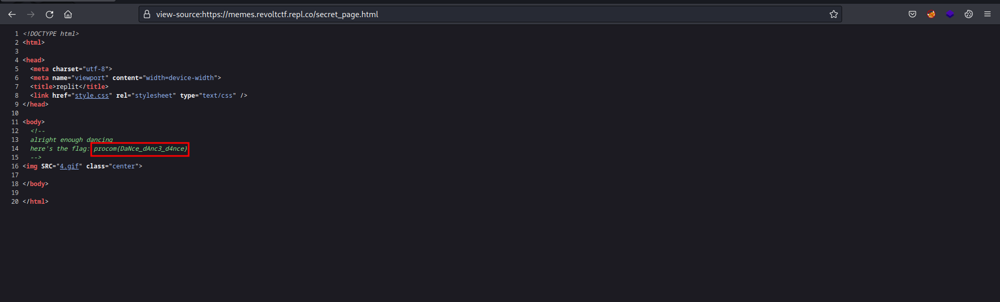

This post is focused on the walkthrough of Procom 2023 CTF by FAST-KHI.

<!--more-->

# Web

## Dance

**Description**

**Solution**

On the provided website reading the source code we are provided with an endpoint `/dance.html` which when we visit again provide another endpoint and so on.

`/dance.html` -> `/hackerman.html` -> `/secret_page.html` -> `flag`

**Flag:** `procom{DaNce_dAnc3_d4nce}`